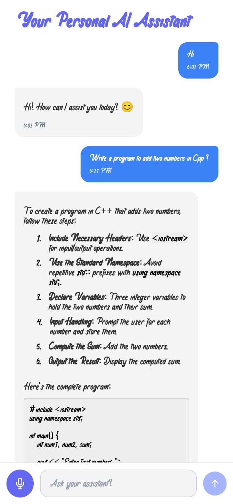

# 🤖 AI Assistant App

A cross-platform voice-enabled AI assistant built with **React Native**. It supports real-time messaging, voice recognition, and AI-generated responses. Built to be fast, intuitive, and conversational.

## ✨ Features

- 🔊 Voice-to-text recognition using native device mic
- 💬 Real-time message interface
- 🤖 AI-generated contextual responses
- 🧠 Chat history management
- 👤 Secure signup & login flow
- 🎨 Clean, modern UI with theming support

---

## 📱 Screenshots

<h3>🏠 Homepage</h3>


<h3>🔐 Login Page</h3>


<h3>📝 Signup Page</h3>


## ⚙️ Tech Stack

- **React Native (Expo)**
- **TypeScript**
- **Zustand** for state management
- **Custom Hooks** for voice input
- **Tailwind CSS (via NativeWind)**
- **Supabase** or custom backend for auth & chat (if applicable)

---

## 🚀 Getting Started

1. **Clone the repository:**
   ```bash
   git clone https://github.com/Sushank-ghimire/personal-ai-assistant.git
   ```
2. **Install dependencies:**
   ```bash
   cd personal-ai-assistant
   bun install
   bun start
   ```
